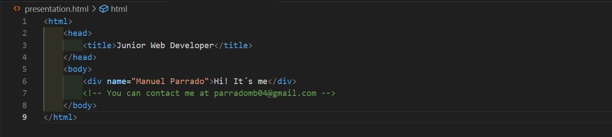

<h2 align="left">Hey there! I'm Manuel Parrado</h2>

<!-- ## 👋 &nbsp;Hey there! I'm Aditya Kanoi -->

### 👨🏻‍💻 &nbsp;About Me

👨‍💻 &nbsp;I'm a Web Developer passionate about coding and learning new technologies.\
💡 &nbsp;I enjoy solving problems and improving my skills in both frontend and backend development.\
🎓 &nbsp;I recently completed an Advanced Technician Course in Web Application Development and I'm currently specializing in Artificial Intelligence & Big Data.\
🌱 &nbsp;I'm on track for learning more about Machine Learning, Data Analysis, and Backend Development.\
⚡ &nbsp;My tech stack includes PHP, Python, Laravel, Angular, Java, Spring Boot, MySQL, REST APIs, Tailwind CSS.\
🛠️ &nbsp;I have experience with preventive and corrective maintenance of computer systems, network configuration, and IT support.\
💬 &nbsp;Feel free to reach out to me for collaborations, tech discussions, or just to connect!\
✉️ &nbsp;You can shoot me an email at **parradomb04@gmail.com**! I'll try to respond as soon as I can.\
🔗 &nbsp;Connect with me on 

## 🛠 Tech Stack  

### 🚀 Languages & Frameworks  
 
 
 
 
 
 
 
 
  

### 💾 Databases & APIs  
 
 
 
  

### 🎨 Frontend & Styling  
 
 
 
  

### ☁️ Cloud & DevOps  
 
 
  

### 🛠 Tools & Other  
 
 
 
 
  

### ⚙️ &nbsp;GitHub Analytics  

  
  

### 🤝🏻 &nbsp;Connect with Me  

    
  

